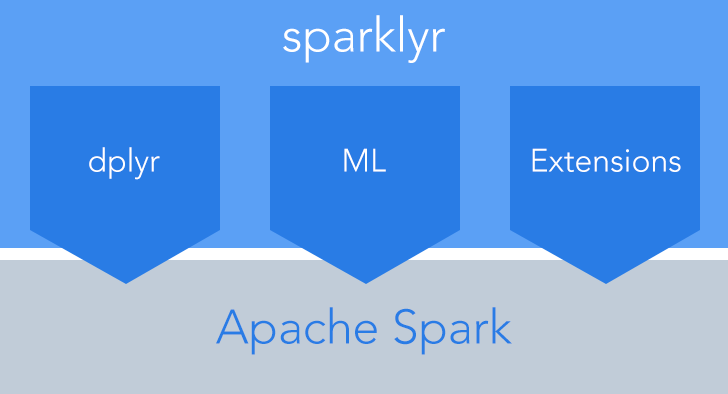

# (PART) Part I {-} 

TBD.


# Introduction to Apache Spark {#intro}


```{r 01-setup, include=FALSE}
knitr::opts_chunk$set(
  cache = FALSE,
  echo = TRUE,
  fig.align = "left",
  fig.width = 6,
  fig.asp = 0.618,
  out.width = "70%",
  message = FALSE
)
```

## What is Spark?

* Apache Spark (https://spark.apache.org/) is a unified analytics engine and cluster computing framework for large-scale data processing.

* Does not use *MapReduce* as an execution engine. Rather, Spark uses its own distributed runtime to execute work on a cluster.

* It is designed to perform both batch processing (similar to MapReduce) and new workloads like streaming, interactive queries, and machine learning

* Spark is closely integrated with *Hadoop*, an open-source software framework for storing data and running applications on clusters.

  - Spark can run on *YARN*. This is the most convenient way to use Spark when you have an existing Hadoop cluster.
  
  - Spark is compatible with Hadoop data (e.g., Spark works with Hadoop file formats and storage backends like *parquet*).

  - To be clear, you do not need Hadoop to run Spark, but you'll need some form of shared file system in order to run Spark on a cluster.


## Why use Spark?

* The most notable feature of Spark is its abaility to keep large working data sets in memory *between jobs*.

* There are two types of preccesses that benefit greatly from Sparks framework:

  - Iterative algorithms.
  
  - Interactive analysis.

* Spark uses a DAG (*directed acyclic graph*) engine which can process arbitrary pipelines of operators that can be translated into a single job for the user.

* Spark has a large community of experienced users.

* Spark provides APIs to three languages: Scala, Java, Python, and R (through the `SparkR` package). An R interface to Apache Spark is also provided by the `sparklyr` package (which we'll primarily be using in this book). Spark also has several built-in SQL functions (Spark SQL).

## Spark DataFrames

A Spark DataFrame is an optimized columnar data structure similar in spirit to R/Pandas data frames. They can be constructed from a wide variety of different including: CSV files, JSON files, parquet files, Hive tables, external databases, data stored on HDFS, and many more. The DataFrame API is available in Scala, Java, Python, and R. The `sparklyr` package provides a `dplyr` backend that works seemlessly with Spark DataFrames. There is also the concept of Spark Datasets, but it will not be discussed in this book.


## APIs to Spark

### Scala

In a terminal, you can start a Spark session by typing
```{bash spark-shell, eval=FALSE}
spark-shell
```


### Java

### Python


### R
  
* The `sparklyr` package:
  
  - Allows you to connect to Spark from R.
    
  - Provides a complete `dplyr` backend.
  
  - Provdes a SQL interface via the `DBI` package.
  
  - Allows you to leverage Spark’s distributed machine learning library (MLlib) from R.
  - Allows you to leverage H2O' machine learning library (SparkingWater).
    
  - Allows you to create extensions that call the full Spark API.
    
  - Provides interfaces to Spark packages.
  
  - For more information visit http://spark.rstudio.com/.
  
```{r sparklyr-illustration, echo=FALSE, fig.cap="Source: http://spark.rstudio.com/tools/readme/sparklyr-illustration.png."}

```

* The `sparkR` package:

### Spark SQL

* You can use of Spark SQL to execute SQL queries.

* Spark SQL can also be used to read data from an existing *Hive* installation.


## Installing Spark

The easiest way to install spark is to use the `sparklyr::spark_install()` function. For example, to install Spark version 2.3.0, use
```{r spark-install, eval=FALSE}
sparklyr::spark_install(
  version = "2.3.0",
  hadoop_version = NULL
)
```

For details, see `?sparklyr::spark_install`. To see what Spark installations are available (along with there associated Hadoop versions), use
```{r spark-available-versions}
library(dplyr)
sparklyr::spark_available_versions(show_hadoop = TRUE) %>%
  arrange(desc(spark), desc(hadoop)) %>%
  slice(1:5)  # only look at five latest versions
```

### Linux

### MacOS

### Windows

* By a Unix machine `r emo::ji("rofl")`.


## Glossary of useful terms

## Further reading

TBD.
